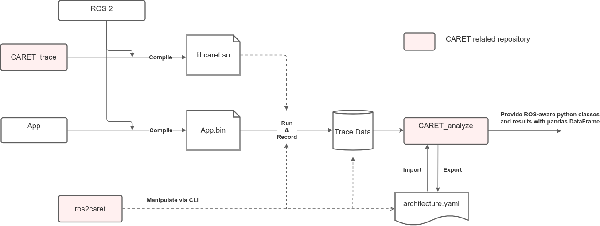

Design describes the internals of CARET.
Below is the measurement flow with each package added to the Tracing Flow.

CARET collects data, which include timestamps, from tracepoints embedded in user application, ROS 2 and DDS. The data set is stored into a storage as "Trace Data".
CARET analyzes the Trace Data and provides the results to the developer.

The Design chapters describe policies and internal processes for each of the steps listed below.

1. Runtimme processing of tracepoints.
1. Adding tracepoints
1. Data processing
1. Latency calculation
1. Visualization

In addition, the followings are explained.

- Software architecture
- Latency definition
- Limits and constraints

See also

- [CARET analyze API document](https://tier4.github.io/CARET_analyze/)
