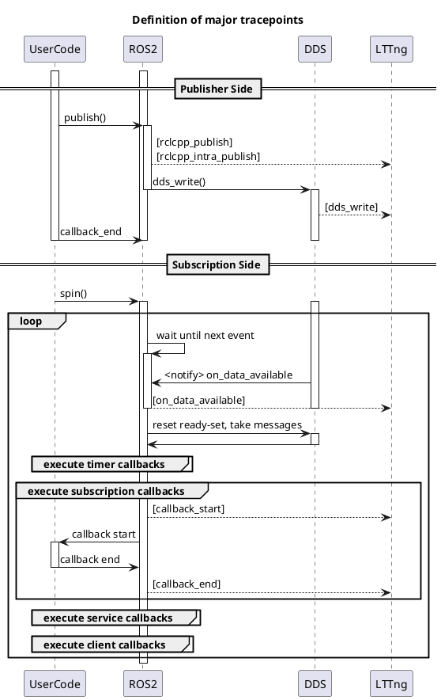

CARET では、通信レイテンシを以下のように定義しています。

$$
l^{comm} = t^{msg}_{in} - t^{msg}_{out}
$$

メッセージがノードまたはコールバックの所有権に出る時刻から、入る時刻までとなっています。

これは将来 tf を含めたレイテンシでも計測するためになっています。

- スケジューリングによって影響を受ける時間になっています。

特に、publish-subscription の場合には、以下のように定義されます。

$$
l^{comm} = t_{sub} - t_{pub}
$$

<prettier-ignore-start>
!!! todo
        スケジューリングの影響を受けるようになっています。通信レイテンシだけではありません。
<prettier-ignore-end>

## プロセス内通信

TODO: 処理のシーケンスを正しく直す。

```plantuml


participant "UserCode\n(Publisher Side)" as Callback
participant "rclcpp\n (Publisher/Subscription)" as Rclcpp
participant "rclcpp\n (Buffer)" as Buffer
participant rcl
participant LTTng

== Publisher ==

-> Callback
activate Callback

Callback -> Rclcpp : publish
activate Rclcpp
Rclcpp -> LTTng : intra process publish

Rclcpp -> Buffer : enqueue
activate Buffer
Rclcpp -> rcl : notify
deactivate Rclcpp
activate rcl

deactivate Callback

== Subscription ==

rcl -> Rclcpp : dispatch
deactivate rcl

activate Rclcpp

Rclcpp -> Buffer : take
Buffer -> Rclcpp: dequeue
deactivate Buffer

Rclcpp -> LTTng : callback start
Rclcpp -> Callback : execute callback

activate Callback

```

## プロセス間通信


