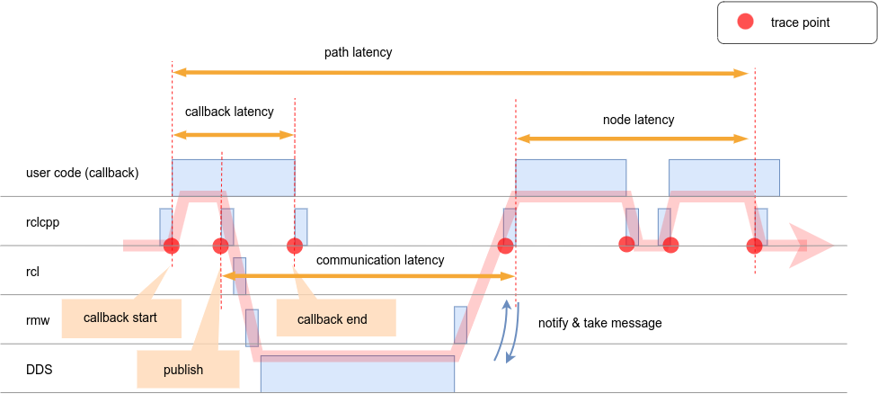

# Latency definition

| target                           | configuration required? |
| -------------------------------- | ----------------------- |
| [Path](./path)                   | Yes                     |
| [NodePath](./node)               | Yes                     |
| [Communication](./communication) | No                      |
| [Callback](./callback)           | No                      |
| [Publisher](./publisher)         | No                      |
| [Subscription](./subscription)   | No                      |
| [Timer](./timer)                 | No                      |
