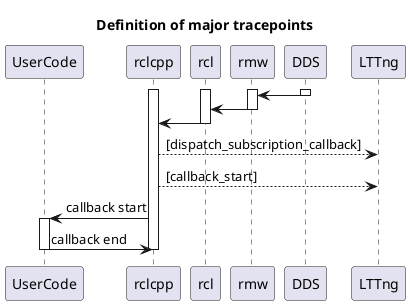
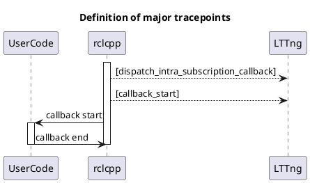

# Subscription

## Inter process communication

- callback_start_timestamp
- message_timestamp
- source_timestamp

## Intra process communication

| trace points             | description                                            |
| ------------------------ | ------------------------------------------------------ |
| callback_start_timestamp | system time                                            |
| message_timestamp        | time of header.stamp. zero when header is not defined. |

See also

- [Subscription API](https://tier4.github.io/CARET_analyze/latest/infra/#caret_analyze.infra.lttng.records_provider_lttng.RecordsProviderLttng.subscribe_records)
- [Runtime trace points](../../trace_points/runtime_trace_points)
