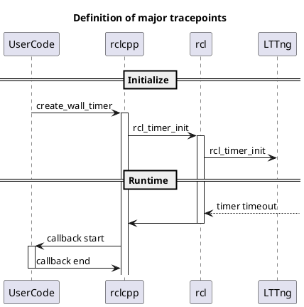

# Timer

Timer callback が起床するの時間や関連する情報を提供します。

rclcpp_publish と intra_publish は早い方が使われます。

Related tracepoints

| trace points             | description |
| ------------------------ | ----------- |
| rclcpp_publish_timestamp | system time |
| rcl_publish_timestamp    | system time |
| dds_write_timestamp      | system time |

See also

- [Publisher API](https://tier4.github.io/CARET_analyze/latest/infra/#caret_analyze.infra.lttng.records_provider_lttng.RecordsProviderLttng.publish_records)
- [Runtime trace points](../../trace_points/runtime_trace_points)
