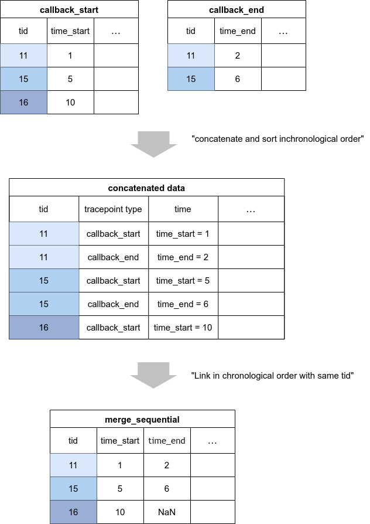

CARET ではレイテンシ算出に関わるトレースデータの加工をテーブルで行っています。

pandas.DataFrame-like な API を備えており、処理速度を早くした C++実装版もあります。

ここではいくつかの主な API について説明します。

## merge

一般的なテーブルの内部結合、外部結合です。

See also

- [API:merge](https://tier4.github.io/CARET_analyze/latest/record/#caret_analyze.record.interface.RecordsInterface.merge)

## merge_sequential

時系列的なマージです。
特に thread による逐次的な処理を結合する際に使います。

CARET はこのような結合を行い、レイテンシを算出しています。

See also

- [API:merge](https://tier4.github.io/CARET_analyze/latest/record/#caret_analyze.record.interface.RecordsInterface.merge_sequential)
- [Callback Latency](../latency_definitions/callback_latency.md)

## merge_sequential_for_addr_track

アドレスを元に紐付けを行い、コピーが発生する際に使うマージです。

See also

- [API:merge_sequential_for_addr_track](https://tier4.github.io/CARET_analyze/latest/record/#caret_analyze.record.interface.RecordsInterface.merge_sequential_for_addr_track)

<prettier-ignore-start>
!!!info
    このmergeは、処理が遅く、caret-rclcppが使われていないノードがpublishした際に不整合が起こってしまいます。
    できる限り、merge_sequentialで事足りるようにトレースポイントを設計すべきです。
<prettier-ignore-end>

## to_dataframe

pandas.DataFrame に変換する関数です。
特に可視化や自前で評価する際には、こちらが使えます。

ただし、pandas.DataFrame は object を含む様々な型を入れられるようになっており、バグの要因になります。
CARET 内部ではできる限り Records で処理し、最後に DataFrame に変換するのが望ましいです。
