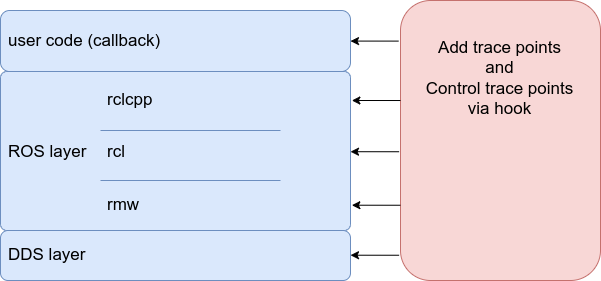

# Hook

Hooking is one of the key techniques performed by CARET.
This section describes hooks from CARET's point of view.

See also

- [CARET_trace](../software_architecture/caret_trace.md)

## Advantage of Hook

ROS 2 is being developed separately from DDS thanks to RMW.
On the other hand, each is developed for different purposes, which may make it difficult to achieve consistent evaluation of all layers, including DDS.
CARET handles these layers across by hooks to add and manage consistent trace points.

See also

- [Tracepoints definition](../../trace_points/)

<prettier-ignore-start>
!!!Info
    If possible, it is a better option for users if tracepoints are added as built-in rather than hooks.
    However, CARET's priority is to evaluate software running on the current version of ROS rather than to gradually add tracepoints.
    For this reason, we have adopted a hook that allows users to add tracepoints in a flexible manner.
<prettier-ignore-end>

<prettier-ignore-start>
!!!Info
    The advantage of being able to handle all layers across the board is not well utilized in the current CARET.
    In the future, we plan to use thread local memory to reduce trace points.
<prettier-ignore-end>

## LD_PRELOAD

### Advantage of LD_PRELOAD

LD_PRELOAD can be hooked even if the function is not exposed externally as an API.

The trace points themselves, which are built into the ros layer, can also be hooked.
This enables trace filtering.

Hooking by eBPF is also an option.
However, eBPF requires a context switch from user space to kernel space.
Hooking with LD_PRELOAD can be completed in user space, reducing the overhead.

See also

- [Tracepoint filtering](./tracepoint_filtering.md)

### Limits of LD_PRELOAD

There are some cases that cannot or are difficult to hook with LD_PRELOAD.

- Functions with many symbols depending on the template
- Hooks for functions that are expanded inline
- Hooks for functions implemented in headers

Specifically, intra-process communication cannot be hooked by LD_PRELOAD.
In CARET, trace points for intra-process communication are added in the forked rclcpp.
