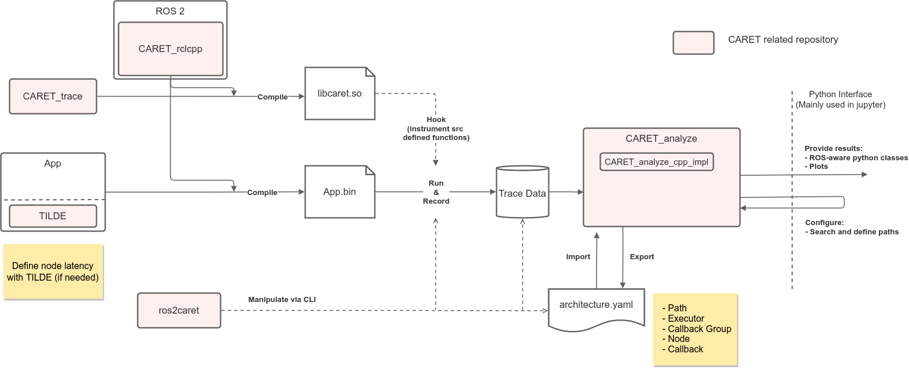

# Architecture overview

This section explains an overview of software architecture of CARET.

CARET は大きく分けて Record と Analyze に分けられています。

## Recording Phase

Recording では、アプリケーションの実行情報をトレースポイントとして保存します。

CARET は ROS2 に組み込まれたトレースポイントに加え、いくつかの方法によりトレースポイントを追加します; CARET_trace と CARET_rclcpp と TILDE がトレースポイントを追加します。
柔軟に必要なトレースポイントの追加を行うために、可能な限りフックによるトレースポイントを追加しています。
フックでの追加ができない場合にのみ、補助的に他の方法でトレースポイントを追加しています。
CARET はトレースに LTTng を利用しています。
トレースポイントで取得した情報は、TraceData として全て保存されます。

See also

- [Tracepoints | Overview](../trace_points/overview.md)
- [Runtime Processing | Overview](../runtime_processing/overview.md)
- [The LTTng Documentation](https://lttng.org/docs/)

## Analyzing Phase

Analyzing Phase では、トレースデータを解析しレイテンシの算出や可視化をします。

A set of trace data is divided into two sections by CARET_analyze package after loading trace data; Architecture and Runtime Data.

Architecture データはパスの定義などを記述しています。
評価対象のパスの定義などは、デベロッパーが指定する必要があります。
一度設定した Architecture 情報は yaml ファイルとして保存し、次回から使用が可能です。

Runtime Data は測定値など測定毎に変化する情報です。
実行時の情報は事前に定義した Architecture 情報と結び付けられ、評価しやすい形の python-API としてデベロッパーに提供されます。

CARET_analyze は PythonAPI を提供することが重要な役割としてありますが、
jupyter 上での評価を簡単にするための可視化も提供しています。

See also

- [Processing trace data | Overview](../processing_trace_data/overview.md)
- [Latency definitions | Overview](../latency_definitions/overview.md)
- [Visualizations | Policy](../visualizations/policy.md)

## ROS 2 Packages

CARET に関連するパッケージと主な役割を以下にまとめます。

| Package                             | Role                                             | Repository                                                                                           |
| ----------------------------------- | ------------------------------------------------ | ---------------------------------------------------------------------------------------------------- |
| [CARET_trace](./caret_trace.md)     | フックでのとレースポイント追加や、ランタイム処理 | [https://github.com/tier4/CARET_trace/](https://github.com/tier4/CARET_trace/)                       |
| CARET_rclcpp                        | フォークによるトレースポイント追加               | [https://github.com/tier4/rclcpp](https://github.com/tier4/rclcpp)                                   |
| ros2caret                           | CARET CLI                                        | [https://github.com/tier4/ros2caret/](https://github.com/tier4/ros2caret/)                           |
| [CARET_analyze](./caret_analyze.md) | トレースデータの解析                             | [https://github.com/tier4/CARET_analyze/](https://github.com/tier4/CARET_analyze/)                   |
| CARET_analyze_cpp_impl              | CARET_analyze の高速化                           | [https://github.com/tier4/CARET_analyze_cpp_impl/](https://github.com/tier4/CARET_analyze_cpp_impl/) |
| [TILDE](./tilde.md)                 | 実装変更を伴うトレースポイントの追加             | [https://github.com/tier4/TILDE](https://github.com/tier4/TILDE)                                     |
