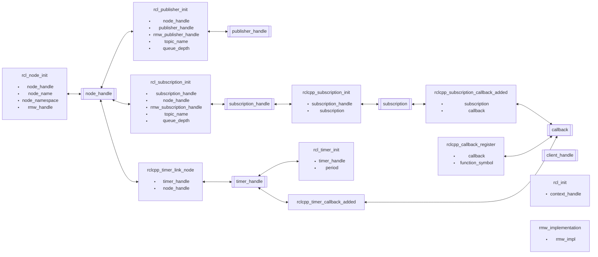
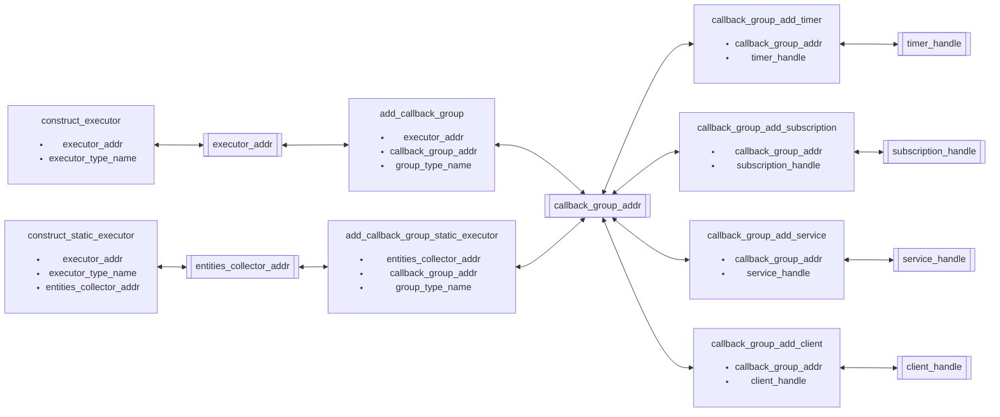

Some tracepoints share a same identification, such as a node ID (`node_handle`) and an address of callback instance. The shared identification associates each tracepoint to another, the association constructs structure of tracepoint relationship. The following figures show four structures.

### Tracepoints for representing structure of a node

If a certain of address of callback instance is unique, scanning the shared identification including `timer_callback_added` lets you identify a node to which the callback belongs.
On the other hand, if `node_handle` is identified uniquely, callback in the node is identified as well.

### Tracepoints for representing structure of executor and callback group

A handler such as `timer_handle` and `subscription_handle` are assigned to a callback group. A callback group belongs to an executor.

### ros2:rcl_init

[Original tracepoints]

Sampled items

- void \* context_handle

---

### ros2:rcl_node_init

[Original tracepoints]

Sampled items

- void \* node_handle
- void \* rmw_handle
- char \* node_name
- char \* node_namespace

---

### ros2:rcl_publisher_init

[Original tracepoints]

Sampled items

- void \* publisher_handle
- void \* node_handle
- void \* rmw_publisher_handle
- char \* topic_name
- size_t queue_depth

---

### ros2:rcl_subscription_init

[Original tracepoints]

Sampled items

- void \* subscription_handle
- void \* node_handle
- void \* rmw_subscription_handle
- char \* topic_name
- size_t queue_depth

---

### ros2:rclcpp_subscription_init

[Original tracepoints]

Sampled items

- void \* subscription_handle
- void \* subscription

---

### ros2:rclcpp_subscription_callback_added

[Original tracepoints]

Sampled items

- void \* subscription
- void \* callback

---

### ros2:rcl_timer_init

[Original tracepoints]

Sampled items

- void \* timer_handle
- int64_t period

---

### ros2:rclcpp_timer_callback_added

[Original tracepoints]

Sampled items

- void \* timer_handle
- void \* callback

---

### ros2:rclcpp_timer_link_node

[Original tracepoints]

Sampled items

- void \* timer_handle
- void \* node_handle

---

### ros2:rclcpp_callback_register

[Original tracepoints]

Sampled items

- void \* callback
- char \* function_symbol

---

### ros2_caret:rmw_implementation

[Hooked tracepoints]

Sampled items

- char \* rmw_impl

---

### ros2_caret:construct_executor

[Hooked tracepoints]

Sampled items

- void \* executor_addr
- char \* executor_type_name

---

### ros2_caret:construct_static_executor

[Hooked tracepoints]

Sampled items

- void \* executor_addr
- void \* entities_collector_addr
- char \* executor_type_name

---

### ros2_caret:add_callback_group

[Hooked tracepoints]

Sampled items

- void \* executor_addr
- void \* callback_group_addr
- char \* group_type_name

---

### ros2_caret:add_callback_group_static_executor

[Hooked tracepoints]

Sampled items

- void \* entities_collector_addr
- void \* callback_group_addr
- char \* group_type_name

---

### ros2_caret:callback_group_add_timer

[Hooked tracepoints]

Sampled items

- void \* callback_group_addr
- void \* timer_handle

---

### ros2_caret:callback_group_add_subscription

[Hooked tracepoints]

Sampled items

- void \* callback_group_addr
- void \* subscription_handle

---

### ros2_caret:callback_group_add_service

[Hooked tracepoints]

Sampled items

- void \* callback_group_addr
- void \* service_handle

---

### ros2_caret:callback_group_add_client

[Hooked tracepoints]

Sampled items

- void \* callback_group_addr
- void \* client_handle
