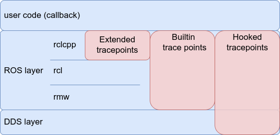

# Tracepoints definition

This section lists all tracepoints and their definition.
Before listing tracepoints.

Some tracepoints are used for collecting identification of executors, nodes, callbacks, and topics during application's initialization. They are called initialization tracepoints. The other tracepoints are embedded for sampling timestamps after completion of initialization, and called runtime tracepoints.

Almost all of tracepoints supported by CARET are embedded in ROS and DDS layer. CARET utilizes some of the tracepoints embedded in original ROS 2 middleware, which are used for ros2-tracing. Some of the rest tracepoints are added to the fork of ROS 2's rclcpp, the other are introduced by function hooking with LD_PRELOAD. AS explained, tracepoints for CARET is embedded by three ways and they are identified as below.

- Builtin tracepoints
  - tracepoints embedded in original ROS 2 middleware which are utilized by ros2-tracing
  - some of tracepoints, for service, action and lifecycle node, are not utilized by CARET
- Extended tracepoints
  - CARET-dedicated tracepoints added to the fork of rclcpp
- Hooked tracepoints
  - CARET-dedicated tracepoints introduced by function hooking with LD_PRELOAD

<prettier-ignore-start>
!!! info
    Please read this section if you are interested in CARET-dedicated tracepoints are extended by the forked rclcpp and LD_PRELOAD. CARET would like to add tracepoints by function hooking as possible. LD_PRELOAD is reasonable to hook functions defined in dynamic library, but it cannot be applied to functions by implemented with C++ template. Such template-based implementation is mapped into binary file after it is built or compiled. Builtin rclcpp uses C++ template for some functions like intra-process communication, for example. The forked rclcpp is introduced to add tracepoints to the functions.
<prettier-ignore-end>
