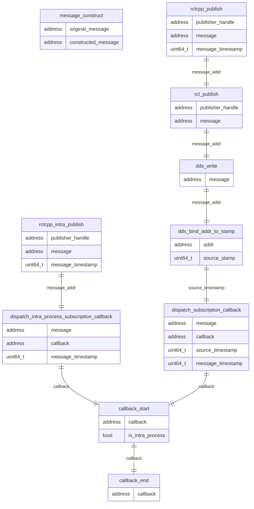

### Tracepoints for representing flow of message transmission

If a topic message is defined with unique_ptr and transmitted to multiple subscription by `publish` method, the topic message may be copied.  
CARET can associate an address of original message to that of copied one by `message_construct`.  
A certain message is identified with an unique address in rcl layer, it is identified with `source_timestamp` in DDS layer.  
All messages communicated via DDS have `source_timestamp` given automatically, which are introduced for QoS function.A pair of publish and subscription same `source_timestamp`.  
CARET utilizes `source_timestamp` to map transmitted message to received one.

CARET maps a `message_addr` to a published message for intra-process communication, and a `source_timestamp` to one for inter-communication.

### Tracepoints for representing flow of callback execution after message reception

As well as flow of message transmission, a message is identified by `message_addr` for intra-process communication, but `source_timestamp` for inter-process communication.

`message_addr` and `source_timestamp` is mapped a corresponding `callback_start`.  
As explained, `message_addr` and `source_timestamp` are identifier for transmission flow using `publish` method.
This means that a invoked `publish` method is mapped to a `callback_start`.

However this does not mean that CARET can map a `callback_start` to a corresponding `publish`. CARET can trace a certain flow from `publish` to `callback_start`, but the reversed mapping, from `callback_start` to `publish`, is not supported by CARET. The capability of mapping between callback_start and publish will be improved in v0.3.\* release or later.

### ros2:callback_start

[Original tracepoints]

Sampled items

- void \* callback
- bool is_intra_process

---

### ros2:callback_end

[Original tracepoints]

Sampled items

- void \* callback

---

### ros2:message_construct

[Extended tracepoints]

Sampled items

- void \* original_message
- void \* constructed_message

---

### ros2:rclcpp_intra_publish

[Extended tracepoints]

Sampled items

- void \* publisher_handle
- void \* message
- uint64_t message_timestamp

---

### ros2:dispatch_subscription_callback

[Extended tracepoints]

Sampled items

- void \* message
- void \* callback
- uint64_t source_timestamp
- uint64_t message_timestamp

---

### ros2:dispatch_intra_process_subscription_callback

[Extended tracepoints]

Sampled items

- void \* message
- void \* callback
- uint64_t message_timestamp

---

### ros2:rcl_publish

[Original tracepoints]

Sampled items

- void \* publisher_handle
- void \* message

---

### ros2:rclcpp_publish

[Original tracepoints]

Sampled items

- void \* publisher_handle
- void \* message
- uint64_t message_timestamp

### ros2_caret:dds_write

[Hooked tracepoints]

Sampled items

- void \* message

---

### ros2_caret:dds_bind_addr_to_stamp

[Hooked tracepoints]

Sampled items

- void \* addr
- uint64_t source_stamp

---

### ros2_caret:dds_bind_addr_to_addr

[Hooked tracepoints]

Sampled items

- void \* addr_from
- void \* addr_to
